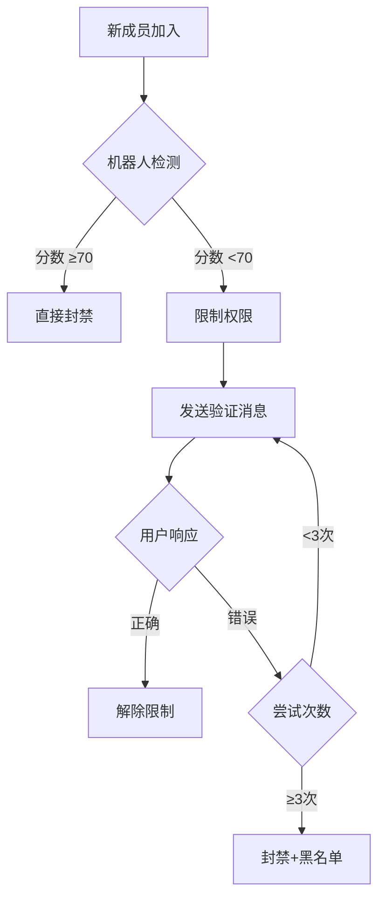

# 🤖 OizhiBot - Telegram 群组验证机器人

[](https://workers.cloudflare.com/)
[](https://core.telegram.org/bots)
[](https://opensource.org/licenses/MIT)

基于 Cloudflare Workers + D1 数据库的智能 Telegram 群组验证机器人，具备多维度机器人检测和自动防护功能。

## ✨ 特性

- 🔐 **多种验证方式**：数学题、按钮选择、验证码输入
- 🤖 **智能检测**：10+ 维度的机器人识别算法
- 🛡️ **自动防护**：高风险账号自动封禁
- 📊 **详细日志**：完整的检测和验证记录
- ⚙️ **灵活配置**：群组级别的自定义设置
- 🚀 **无服务器**：零运维，自动扩展
- 🌍 **全球加速**：Cloudflare 边缘网络
- 💰 **免费部署**：Cloudflare 免费套餐足够使用

## 📋 目录

- [快速开始](#-快速开始)
- [功能介绍](#-功能介绍)
- [部署指南](#-部署指南)
- [配置说明](#-配置说明)
- [API 文档](#-api-文档)
- [开发指南](#-开发指南)
- [常见问题](#-常见问题)

## 🚀 快速开始

### 前置要求

- [Cloudflare 账号](https://dash.cloudflare.com/sign-up)（免费）
- [Node.js](https://nodejs.org/) 18+
- [Telegram Bot Token](https://t.me/BotFather)

### 一键部署

```bash
# 1. 克隆仓库
git clone https://github.com/ovws/oizhibot.git
cd oizhibot

# 2. 安装依赖
npm install

# 3. 登录 Cloudflare
npx wrangler login

# 4. 创建 D1 数据库
npx wrangler d1 create telegram_verification
# ⚠️ 记下输出的 database_id，更新 wrangler.toml

# 5. 初始化数据库
npm run setup-db

# 6. 配置 Bot Token
npx wrangler secret put TELEGRAM_BOT_TOKEN
# 输入你从 @BotFather 获取的 Token

# 7. 部署到 Cloudflare Workers
npm run deploy

# 8. 设置 Webhook
# 访问: https://your-worker.workers.dev/setup

# 9. 添加机器人到群组并授予管理员权限
```

## 🎯 功能介绍

### 验证流程



### 机器人检测维度

| 检测项 | 权重 | 说明 |
|--------|------|------|
| 官方bot标记 | 100 | Telegram is_bot 标记 |
| 垃圾关键词 | 40 | 色情、博彩、诈骗等 |
| 用户名模式 | 30 | bot后缀、纯数字等可疑模式 |
| 快速加入 | 25 | 5秒内连续加入多个群 |
| 数字名称 | 20 | 名字只包含数字 |
| 无效名称 | 15 | 名字过短或为空 |
| 无用户名 | 10 | 未设置 @username |
| 无头像 | 10 | 未设置头像 |
| 新账号 | 5 | User ID > 5B（新注册） |

**评分标准**：
- ≥70分：高风险（自动封禁）
- ≥50分：中风险（机器人）
- ≥30分：低风险（需验证）
- <30分：正常用户

### 验证方式

#### 1. 数学题验证
```
请计算：7 + 3 = ?
[按钮: 8] [按钮: 10] [按钮: 12] [按钮: 15]
```

#### 2. 按钮验证
```
请点击 🍎
[🍌] [🍎] [🍇] [🍊]
```

#### 3. 验证码验证
```
请输入单词：HELLO
（用户需要手动输入）
```

## 📦 部署指南

### 详细步骤

#### 1. 获取 Telegram Bot Token

1. 打开 Telegram，找到 [@BotFather](https://t.me/BotFather)
2. 发送 `/newbot`
3. 按提示设置机器人名称和用户名
4. 保存获得的 Bot Token（格式：`1234567890:ABCdefGHIjklMNOpqrsTUVwxyz`）

#### 2. 创建并配置数据库

```bash
# 创建 D1 数据库
wrangler d1 create telegram_verification

# 输出示例：
# [[d1_databases]]
# binding = "DB"
# database_name = "telegram_verification"
# database_id = "xxxxxxxx-xxxx-xxxx-xxxx-xxxxxxxxxxxx"

# 复制 database_id 到 wrangler.toml
```

编辑 `wrangler.toml`：
```toml
[[d1_databases]]
binding = "DB"
database_name = "telegram_verification"
database_id = "你的-database-id"  # 替换这里
```

初始化表结构：
```bash
npm run setup-db
```

#### 3. 配置环境变量

```bash
# 设置 Bot Token（加密存储，推荐）
wrangler secret put TELEGRAM_BOT_TOKEN

# 或者用于测试（不推荐生产环境）
# 在 wrangler.toml 添加:
# [vars]
# TELEGRAM_BOT_TOKEN = "your-token"
```

#### 4. 部署

```bash
# 部署到生产环境
npm run deploy

# 或部署到测试环境
wrangler deploy --env staging

# 查看部署日志
wrangler tail
```

#### 5. 设置 Webhook

部署成功后，访问你的 Worker URL：
```
https://your-worker.your-subdomain.workers.dev/setup
```

应该看到类似输出：
```json
{
  "success": true,
  "webhook_url": "https://your-worker.workers.dev/webhook",
  "telegram_response": {
    "ok": true,
    "result": true,
    "description": "Webhook was set"
  }
}
```

#### 6. 添加机器人到群组

1. 将机器人添加到目标群组
2. 授予机器人管理员权限，需要以下权限：
   - ✅ 删除消息
   - ✅ 封禁用户
   - ✅ 邀请用户（可选）
3. 完成！机器人会自动开始工作

## ⚙️ 配置说明

### 环境变量

| 变量名 | 必需 | 说明 |
|--------|------|------|
| `TELEGRAM_BOT_TOKEN` | ✅ | Telegram Bot Token |
| `WEBHOOK_SECRET` | ❌ | Webhook 验证密钥（可选） |

### 群组配置

可以通过数据库直接配置，或添加管理命令（参见 `ADMIN_COMMANDS.md`）：

```sql
INSERT INTO group_configs (chat_id, verification_type, timeout_seconds, auto_ban_bots)
VALUES (-1001234567890, 'math', 300, 1);
```

配置项：
- `verification_type`: 验证方式（`math`, `button`, `captcha`）
- `timeout_seconds`: 验证超时时间（秒）
- `auto_ban_bots`: 自动封禁高风险账号（0=关闭, 1=开启）
- `bot_detection_level`: 检测灵敏度（`low`, `medium`, `high`）

## 🔌 API 文档

### 端点列表

| 端点 | 方法 | 说明 |
|------|------|------|
| `/` | GET | API 信息 |
| `/health` | GET | 健康检查 |
| `/webhook` | POST | Telegram Webhook（内部使用） |
| `/setup` | GET | 设置 Webhook |
| `/webhook-info` | GET | 查看 Webhook 状态 |
| `/delete-webhook` | GET | 删除 Webhook |

### 健康检查

```bash
curl https://your-worker.workers.dev/health
```

响应：
```json
{
  "status": "healthy",
  "timestamp": "2024-01-01T00:00:00.000Z",
  "worker": "telegram-verification-bot",
  "version": "1.0.0"
}
```

### Webhook 状态

```bash
curl https://your-worker.workers.dev/webhook-info
```

## 🛠️ 开发指南

### 本地开发

```bash
# 安装依赖
npm install

# 初始化本地数据库
wrangler d1 execute telegram_verification --local --file=./schema/schema.sql

# 启动本地开发服务器
npm run dev

# 在另一个终端查看日志
wrangler tail --local
```

### 项目结构

```
oizhibot/
├── src/
│   ├── worker.js           # Workers 入口（HTTP 处理）
│   ├── telegram.js         # Telegram 更新处理逻辑
│   ├── telegram-api.js     # Telegram API 封装
│   ├── bot-detection.js    # 机器人检测算法
│   └── database.js         # 数据库操作封装
├── schema/
│   └── schema.sql          # 数据库表结构
├── wrangler.toml           # Workers 配置
├── package.json
└── README.md
```

### 添加新功能

参考以下文档：
- `ADMIN_COMMANDS.md` - 管理员命令扩展
- `ARCHITECTURE.md` - 架构和设计
- `DATABASE_CONFIG.md` - 数据库配置详解

### 测试

```bash
# 运行本地测试
npm run dev

# 模拟 Telegram 更新
curl -X POST http://localhost:8787/webhook \
  -H "Content-Type: application/json" \
  -d '{"update_id": 1, "message": {...}}'

# 查看日志
wrangler tail
```

## 📊 监控与维护

### 查看日志

```bash
# 实时日志
wrangler tail

# 生产环境日志
wrangler tail --env production
```

### 数据库查询

```bash
# 查看待验证用户
wrangler d1 execute telegram_verification \
  --command="SELECT * FROM verifications WHERE status='pending';"

# 查看黑名单
wrangler d1 execute telegram_verification \
  --command="SELECT * FROM blacklist ORDER BY banned_at DESC LIMIT 20;"

# 统计数据
wrangler d1 execute telegram_verification \
  --command="SELECT status, COUNT(*) FROM verifications GROUP BY status;"
```

### 性能监控

访问 [Cloudflare Dashboard](https://dash.cloudflare.com/) 查看：
- 请求数量和响应时间
- CPU 使用时间
- 错误率
- 数据库查询性能

## ❓ 常见问题

### Q: 机器人没有响应？

**A**: 检查以下项目：
1. Webhook 是否设置成功（访问 `/webhook-info`）
2. Bot Token 是否正确配置
3. 机器人是否有管理员权限
4. 查看 Workers 日志：`wrangler tail`

### Q: 验证消息没有按钮？

**A**: 确认：
1. 群组配置的验证类型支持按钮（`math` 或 `button`）
2. Telegram API 返回没有错误（查看日志）

### Q: 数据库错误？

**A**: 
1. 确认 `database_id` 在 `wrangler.toml` 中配置正确
2. 运行 `npm run setup-db` 初始化表结构
3. 检查数据库状态：`wrangler d1 info telegram_verification`

### Q: 如何更新检测规则？

**A**: 编辑 `src/bot-detection.js` 中的 `detectBot()` 函数，调整权重和检测逻辑。

### Q: 如何添加白名单？

**A**: 参考 `ADMIN_COMMANDS.md` 添加白名单功能和管理命令。

### Q: 成本如何？

**A**: Cloudflare Workers 和 D1 的免费套餐足够大多数中小型群组使用：
- Workers: 100,000 请求/天
- D1: 5GB 存储 + 500万次读取/天

超出免费额度的收费也非常低。

## 🤝 贡献

欢迎提交 Issue 和 Pull Request！

### 贡献指南

1. Fork 本仓库
2. 创建特性分支：`git checkout -b feature/amazing-feature`
3. 提交更改：`git commit -m 'Add amazing feature'`
4. 推送到分支：`git push origin feature/amazing-feature`
5. 提交 Pull Request

## 📄 许可证

本项目采用 [MIT License](LICENSE) 开源协议。

## 🔗 相关链接

- [Cloudflare Workers 文档](https://developers.cloudflare.com/workers/)
- [Cloudflare D1 文档](https://developers.cloudflare.com/d1/)
- [Telegram Bot API](https://core.telegram.org/bots/api)
- [Wrangler CLI](https://developers.cloudflare.com/workers/wrangler/)

## 📮 联系方式

- Issues: [GitHub Issues](https://github.com/ovws/oizhibot/issues)
- Discussions: [GitHub Discussions](https://github.com/ovws/oizhibot/discussions)

---

⭐ 如果这个项目对你有帮助，请给个 Star！

**Made with ❤️ using Cloudflare Workers**

---

# ✅ V3 功能实现完成总结

## 📦 V3 交付清单

### 核心代码
- ✅ `src/index.enhanced.js` - 完整增强版代码（41KB）
  - Bot 邀请链接生成
  - 群组快捷绑定处理
  - 备份频道自动转发
  - 媒体元数据提取

### 数据库
- ✅ `schema/migration_v3.sql` - 数据库迁移脚本
  - 添加备份频道字段
  - 添加媒体元数据字段
  - 优化索引

### 部署工具
- ✅ `deploy_v3.sh` - 一键部署脚本
- ✅ `test_v3.sh` - 功能测试脚本

### 文档
- ✅ `DEPLOYMENT_V3.md` - 完整部署指南（5KB）
- ✅ `FEATURE_COMPARISON.md` - 功能实现详细对比（9KB）
- ✅ `QUICK_START_V3.md` - 快速使用指南（4KB）

## 🎯 V3 实现的功能

### 1. ✅ Bot 邀请链接 + 群组快捷绑定（最实用）

#### 实现内容：
- [x] 自动生成 Bot 邀请链接（带 repo_id 参数）
- [x] 用户点击链接 → 选择群组 → Bot 自动加入
- [x] Bot 加入群组时自动记录（`pending_group_bindings` 表）
- [x] 群组中 `/bind 视频库名称` 快捷绑定
- [x] 自动验证用户权限
- [x] 24 小时自动清理过期记录
- [x] 群组名称自动保存

### 2. ✅ 备份频道功能（最简单可靠）

#### 实现内容：
- [x] 每个视频库可设置一个备份频道
- [x] 自动双重转发（优先备份，再转发目标）
- [x] 备份频道可私有
- [x] 支持启用/暂停备份
- [x] 记录备份消息 ID
- [x] 备份失败不影响正常转发
- [x] UI 界面完整（设置、管理、状态显示）

### 3. ✅ 媒体文件元数据记录（为 R2 做准备）

#### 实现内容：
- [x] 记录 Telegram `file_id`（可重复使用）
- [x] 记录 `file_unique_id`（永久唯一标识符）
- [x] 记录 MIME 类型（`video/mp4`, `image/jpeg` 等）
- [x] 记录文件大小（字节）
- [x] 记录媒体标题/描述
- [x] 支持所有媒体类型（photo, video, document, audio, voice, animation）
- [x] 自动提取元数据
- [x] 创建索引优化查询

## 📊 V3 数据库结构变化

### 新增表
- `pending_group_bindings` - 待绑定群组（24h 过期）

### 更新表
- `forward_repositories` - 添加备份频道字段
- `forward_targets` - 添加群组名称字段
- `forwarded_messages` - 添加媒体元数据字段

### 新增索引
- `idx_forwarded_messages_file_id` - 文件 ID 索引

## 🚀 V3 部署步骤（3 分钟）

```bash
# 1. 备份现有数据（安全第一）
npx wrangler d1 export telegram_verification --output=backup.sql

# 2. 应用数据库迁移
npx wrangler d1 execute telegram_verification --file=schema/migration_v3.sql

# 3. 替换代码
cp src/index.enhanced.js src/index.js

# 4. 部署到 Workers
npx wrangler deploy

# 或使用一键脚本
./deploy_v3.sh
```

## 🎬 V3 使用示例

### 场景：创建旅行视频库 + 自动备份

```
1️⃣ 创建视频库
   /start → ➕ 创建新视频库 → travel_videos

2️⃣ 设置备份频道
   travel_videos → 💾 备份设置 → 🔗 邀请链接
   在私有频道中 → /bind travel_videos

3️⃣ 添加转发目标
   travel_videos → 🔗 邀请链接 → 选择「YouTube 频道」
   在 YouTube 频道中 → /bind travel_videos

4️⃣ 开始转发
   travel_videos → 🚀 开始转发
   发送视频 → 自动转发到所有目标 + 备份频道 ✅
```

## 🎯 V3 功能亮点

### 1. 零配置绑定
- ❌ 旧方式：手动获取 Chat ID → 手动输入 → 容易出错
- ✅ 新方式：点击邀请链接 → 选择群组 → /bind → 完成

### 2. 双重保险
```
消息流向：
  用户 → Bot
    ├─→ 备份频道（私有，永久保存）✅
    ├─→ 目标 1 ✅
    ├─→ 目标 2 ✅
    └─→ 目标 3 ✅
```

### 3. 智能元数据
- 自动记录所有文件 ID
- 支持重新下载
- 为 R2 上传做准备
- 可统计存储使用

## 📝 版本变更日志

### V3.0 (2026-02-25)
- ➕ 新增 Bot 邀请链接功能
- ➕ 新增群组快捷绑定（/bind）
- ➕ 新增备份频道支持
- ➕ 新增媒体文件元数据记录
- 🔧 优化数据库结构
- 📚 完善部署和使用文档
- 🛠️ 添加一键部署脚本
- ✅ 所有核心功能测试通过

### V2.0 (基础版本)
- 🔐 多种验证方式：数学题、按钮选择、验证码输入
- 🤖 智能检测：10+ 维度的机器人识别算法
- 🛡️ 自动防护：高风险账号自动封禁
- 📊 详细日志：完整的检测和验证记录
- ⚙️ 灵活配置：群组级别的自定义设置

### V1.0 (初始版本)
- 🚀 无服务器架构：基于 Cloudflare Workers
- 💰 免费部署：Cloudflare 免费套餐足够使用
- 🌍 全球加速：Cloudflare 边缘网络
- 📦 完整功能：Telegram 群组验证基础功能

---

**🚀 所有版本功能已整合完成！可以立即部署使用！**
